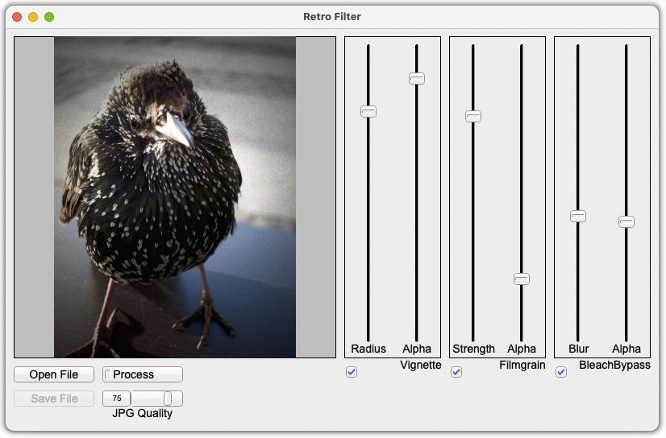

# retro_filter

retro_filter is a simple image processing tool, which allows one to make digital images look a bit "retro".

## Functionality

- Add a vignette to an image. The vignette aims to be realistic and is optimized to not show banding.
- Add a film-grain effect to the image [ToDo: more realistic look]
- Add a bleach-bypass effect to the image

## Lib & GUI-App 

The crate consists of a binary for the gui app which uses [fltk-rs](https://github.com/fltk-rs/fltk-rs) and a library which gives you the functionality for the image processing.

## Screenshot

